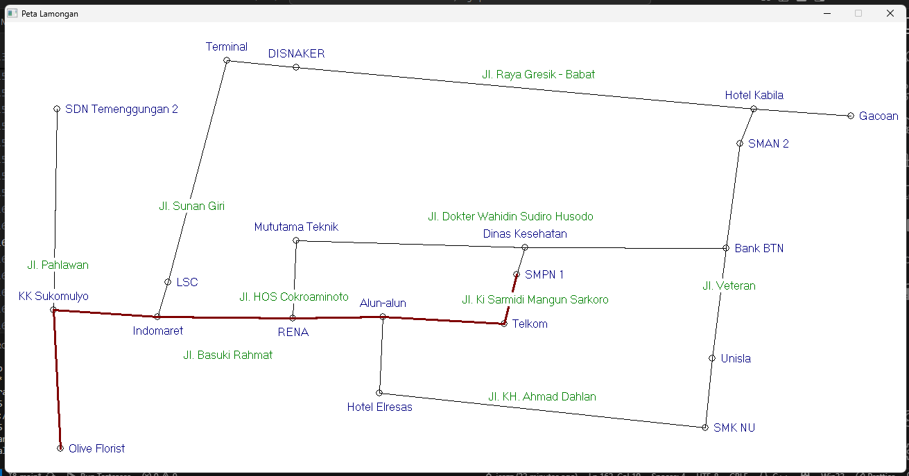

# Google Maps Visualization - Strukdat

Tugas Meniru Google Maps versi 0.01 (Peta sekitar SMPN 1 Lamongan)

---

## Cara Menjalankan

1. **Clone repository ini**
   ```
   git clone https://github.com/icazz/google-maps.git
   cd google-maps
   ```
2. **Build program**
   ```
   make
   ```
3. **Jalankan progam**
   Di Linux/MacOS:

   ```
   ./main
   ```

   Di Windows (cmd/powershell):

   ```
   .\main.exe
   ```

## Hasil


